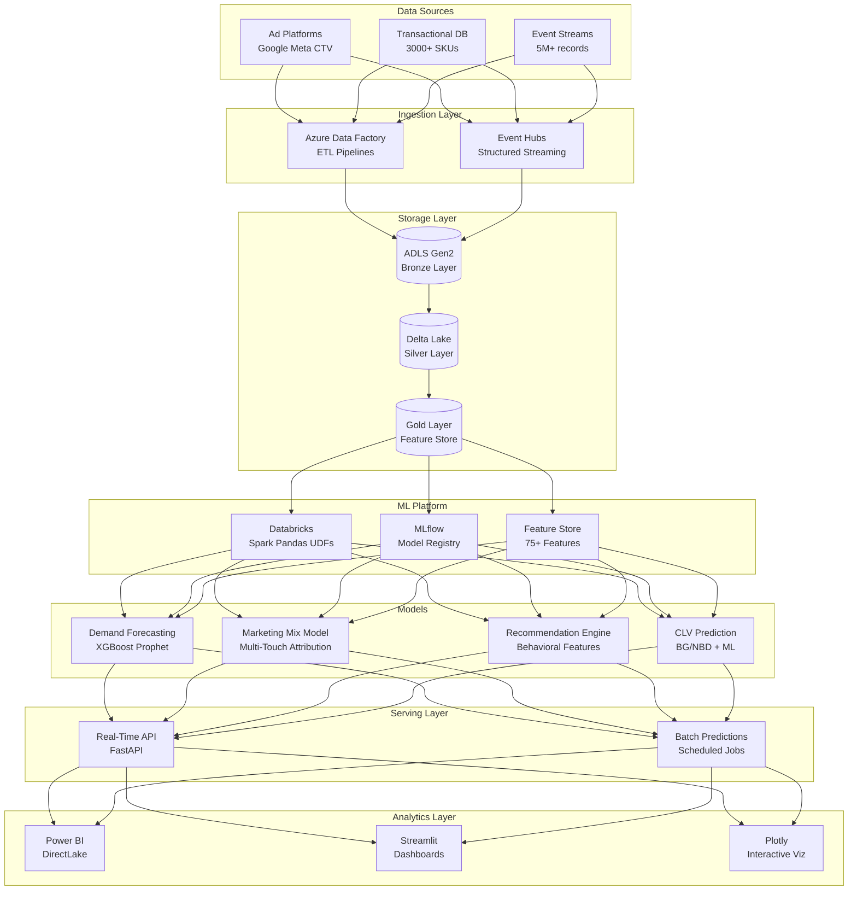
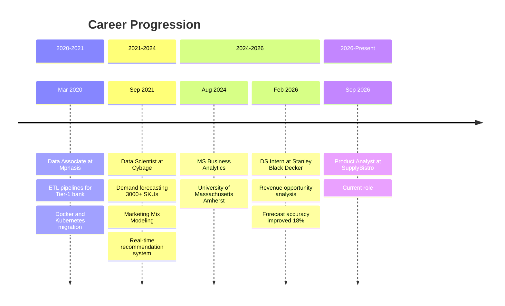
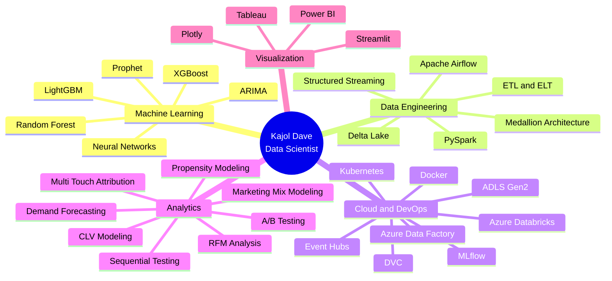
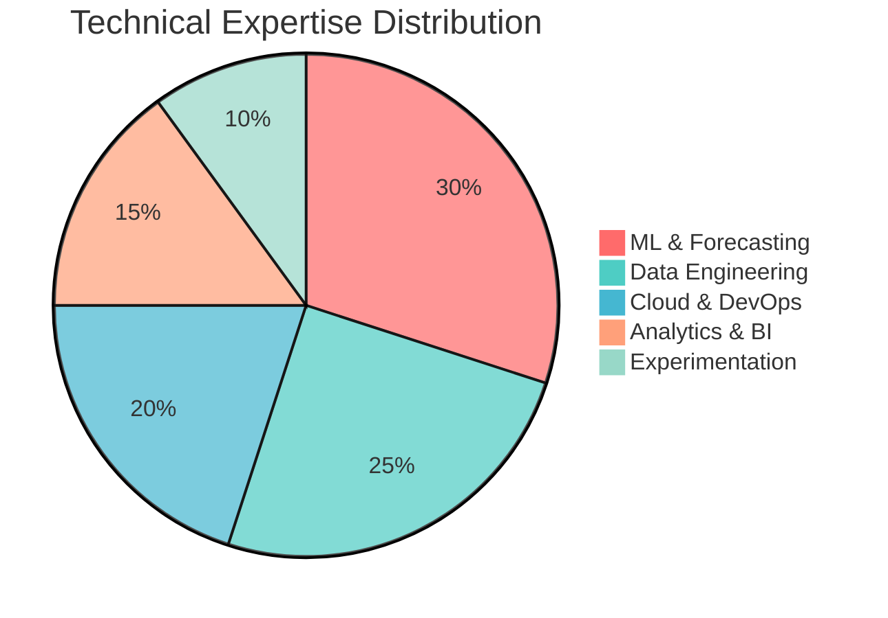

  

---

## 👋 About Me

Data Scientist with **4+ years of production experience** building end-to-end ML systems that drive measurable business impact. Specialized in **demand forecasting**, **marketing analytics**, and **real-time personalization pipelines** across retail and digital marketing domains. Expert in translating complex data challenges into scalable, production-grade solutions using Python, SQL, PySpark, and Azure cloud infrastructure.

**Current Focus:** Product Analytics at SupplyBistro | MS Business Analytics @ UMass Amherst

**Core Expertise:** Forecasting Models • Marketing Mix Modeling • Real-Time ML Pipelines • Cloud-Native Data Engineering • A/B Testing & Experimentation

---

## 🏗️ System Architecture & Data Flow

---

## 💼 Professional Journey

---

## 🎯 Technical Expertise

---

## 🛠️ Technology Stack

### **Programming & Data Science**

### **Machine Learning & MLOps**

### **Cloud & Data Engineering**

### **Analytics & Visualization**

---

## 📊 Skill Distribution

---

## 🚀 Featured Projects

### 🎯 [Customer Lifetime Value Engine](https://github.com/Kajoldave173/clv-engine)

**Production-grade CLV prediction system with explainability and drift monitoring**

Built a hybrid probabilistic-ML pipeline combining BG/NBD, Gamma-Gamma, and Optuna-tuned XGBoost on **1M+ e-commerce transactions**, achieving **50% MAE reduction** over baseline (£673 → £334, R² 0.965).

**Key Features:**
- SHAP-powered explainability dashboard with What-If simulator for campaign ROI estimation
- PSI drift monitoring with 94 pytest tests ensuring production reliability
- DVC-versioned artifacts with MLflow tracking for reproducible experiments

**Tech Stack:** `Python` `XGBoost` `SHAP` `Streamlit` `Docker` `MLflow` `DVC` `Optuna`

**Impact:** Enables data-driven customer segmentation and targeted marketing strategies with quantified uncertainty

---

### 🧪 [Online Experimentation Platform](https://github.com/Kajoldave173/experimentation-platform)

**Sequential testing framework demonstrating rigorous A/B test methodology**

Demonstrated that daily A/B test monitoring **inflates false positives from 5% to 25-30%** on 50K+ simulated sessions. Implemented **mSPRT sequential testing** enabling valid anytime checks while maintaining statistical rigor.

**Key Features:**
- Thompson Sampling bandit dynamically routing **85%+ traffic** to winning treatment in real-time
- Interactive Streamlit simulator for hypothesis testing education
- Comprehensive statistical validation using SciPy and statsmodels

**Tech Stack:** `Python` `SciPy` `statsmodels` `NumPy` `Plotly` `Streamlit`

**Impact:** Reduces user exposure to underperforming variants while maintaining statistical validity

---

### 📈 [Surecast: Calibrated Demand Forecasting](https://github.com/Kajoldave173/surecast)

**Day-ahead demand forecaster with conformalized prediction intervals and SHAP explainability**

Built an honest forecasting system on UCI bike-share data featuring **conformalized quantile regression** for calibrated uncertainty estimates. Gradient-boosted model achieves **23% MAE reduction** over seasonal-naive baseline with prediction intervals achieving **87.5% empirical coverage** on held-out data.

**Key Features:**
- Conformalized prediction intervals (not just point forecasts) via CQR
- SHAP explainability for every prediction with interactive dashboard
- Honest rolling-origin backtesting with strict anti-leakage guards
- Automated model card generation from metrics

**Tech Stack:** `Python` `scikit-learn` `SHAP` `Streamlit` `matplotlib`

**Impact:** Quantifies forecast uncertainty in a way decision-makers can trust

---

### 🔍 [InfoHunter: OSINT Intelligence Suite](https://github.com/Kajoldave173/infohunter)

**Modular OSINT automation platform for security intelligence gathering**

Built a comprehensive Open Source Intelligence suite for collecting and analyzing information about users, emails, and domains. Generates professional reports (PDF, JSON) with both interactive and automated workflows.

**Key Features:**
- Username analysis across social networks (Sherlock, Maigret integration)
- Email leak and password checks (HIBP, Holehe, IntelX, EmailRep)
- Domain intelligence (WHOIS, DNS, Shodan, Hunter.io, VirusTotal)
- Streamlit web frontend with .env editor and report management
- Automation-ready CLI for bot/API integration

**Tech Stack:** `Python` `Streamlit` `APIs` `Automation`

**Impact:** Streamlines security research and threat intelligence workflows

---

### 🛡️ [Email Phishing Detector V3](https://github.com/Kajoldave173/email-phishing-detection)

**Multi-faceted phishing detection with OCR, threat intelligence, and AI assessment**

Analyzes email files (.eml, .msg) using header analysis, content inspection, VirusTotal threat intelligence, OCR for images, and AI-powered triage. Features persistent caching and async processing for production scalability.

**Key Features:**
- Comprehensive parsing with authentication result analysis (SPF, DKIM, DMARC)
- OCR integration extracting text from image attachments (Tesseract, Pillow)
- VirusTotal API v3 integration with SQLite caching via aiohttp
- AI-powered structured assessment with phishing scores and confidence
- Detailed colorized console reports with optional JSON export

**Tech Stack:** `Python` `aiohttp` `aiosqlite` `Tesseract` `OpenRouter API` `colorama`

**Impact:** Automates security analysis with explainable AI-driven threat assessment

---

### 🎲 [Stockastic: ML-Powered Stock Forecasting](https://github.com/Kajoldave173/stockastic)

**Interactive stock price prediction app with ARIMA time-series forecasting**

Built a web-based stock analysis platform fetching real-time financial data from Yahoo Finance and generating multi-day price forecasts using ARIMA models with interactive Plotly visualizations.

**Key Features:**
- Real-time data fetching with YFinance API integration
- ARIMA time-series forecasting with StatsModels
- Interactive financial charts with historical and forecast views
- Responsive Streamlit design working on all devices

**Tech Stack:** `Python` `Streamlit` `YFinance` `StatsModels` `Plotly`

**Disclaimer:** Educational tool for investment research, not financial advice

---

### 🔄 [DriftGuard: ML Lifecycle Automation](https://github.com/Kajoldave173/driftguard)

**End-to-end ML lifecycle with drift detection and auto-retraining**

Built a closed-loop system demonstrating train → track (MLflow) → serve (FastAPI) → detect drift → auto-retrain. Achieved **44.6% MAE reduction** on held-